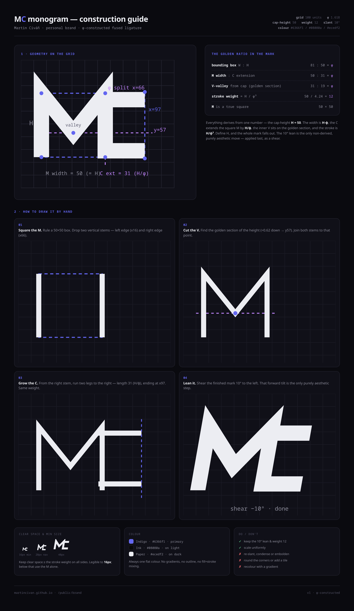

# MC monogram — brand spec

A φ-constructed, fused **MC** ligature: the M's right stem doubles as the C's
spine. Geometric, constructivist, single-colour — built to read from a 16px
favicon up to a wall. Inspired (in *language*, not era) by the interlocking
constructivist mark of ČKD.



## Geometry (100-unit grid)

Everything derives from one number — the **cap-height `H = 50`** — and **φ = 1.618**.

| element            | value | rule                         |
|--------------------|-------|------------------------------|
| cap-height `H`     | 50    | y 26 → 76                    |
| total width `W`    | 81    | `H · φ` (golden rectangle)   |
| M width            | 50    | a true 50×50 square          |
| M stems            | x16, x66 | left / right edge of square |
| M : C split        | x66   | golden section of `W`        |
| C leg extension    | 31    | `H / φ` (x66 → x97)          |
| C legs (y)         | 31, 71 | centred on the M, height 40 |
| inner V valley     | y57   | golden section of `H` (31:19 = φ) |
| stroke weight      | 12    | `H / φ³`                     |
| slant              | 10°   | left shear — the only non-derived, purely aesthetic step |

Ratios that hold: `W : H = φ`, `M-width : C-extension = φ`, `V-depth : remainder = φ`.

## Path data

Drawn upright, then sheared via a portable `matrix()` (no `transform-origin`
dependency, so it survives favicons, Illustrator, print):

```
transform = matrix(1, 0, -0.17633, 1, 8.8165, 0)   # = skewX(-10°) pivoted at y50

M (stroke, width 12, butt caps, miter joins):
  M16 76 V26 L41 57 L66 26 V76
C top leg (fill):    M60 25 H97 V37 H60 Z
C bottom leg (fill): M60 65 H97 V77 H60 Z
```

viewBox: `-2 14 110 74` (artwork) · `-2 -4 110 110` (square / favicon).

## Colour

Always one flat colour — no gradients, no outline, no fill+stroke mixing.

| name   | hex      | use            |
|--------|----------|----------------|
| Indigo | `#6366f1`| primary / favicon |
| Ink    | `#08080a`| on light       |
| Paper  | `#ecedf2`| on dark        |

On the website the mark inherits `currentColor` (see `src/components/Logo.astro`).

## Usage

- Clear space ≥ the stroke weight (12 units) on all sides.
- Legible to **16px**; below that, use the M alone.
- **Do:** keep the 10° lean and weight 12; scale uniformly.
- **Don't:** re-slant, condense/embolden, round corners, add a tile, or recolour with a gradient.

## Files

- `mc-mark.svg` — ink (#08080a), for light backgrounds / print
- `mc-mark-inverse.svg` — paper (#ecedf2), for dark backgrounds
- `mc-mark-indigo.svg` — primary indigo (#6366f1)
- `mc-construction.html` / `.png` — this construction & usage guide (regenerate the
  PNG from the HTML with a headless-Chromium full-page screenshot)
